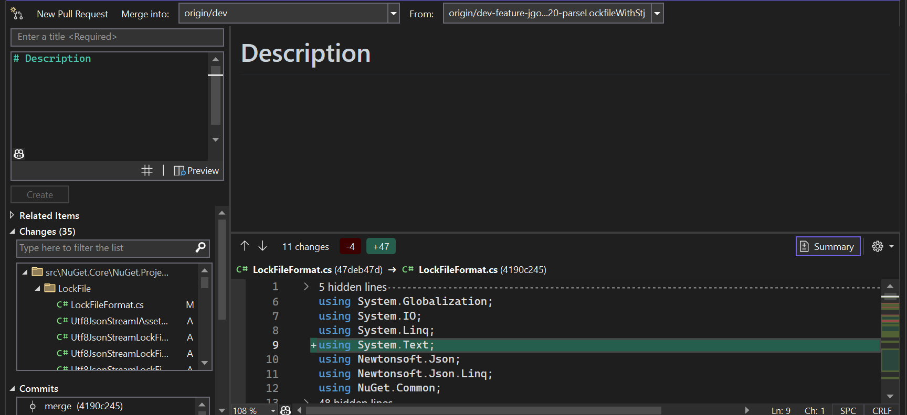

# Markdown Readme Rendering in PM UI

- Jonatan Gonzalez ([jgonz120](https://github.com/jgonz120)) 
- Issue [#12583](https://github.com/NuGet/Home/issues/12583) <!-- GitHub Issue link -->
- [Feature Spec](https://github.com/NuGet/Home/blob/7943122dffa435f4daeee600efcc5b744cd2e97e/accepted/2023/PMUI-Readme-rendering.md)

## Summary

We want to update the packages pane in the PMUI to render the ReadMe for the selected package.

## Motivation 

The Readme file is an essential source of information that can help customers understand what a package does.
By rendering the Readme file directly in the PM UI, customers can easily access the information they need to determine if a package will be helpful to them while searching, browsing, and managing their projects’ packages.
This enhancement streamlines the user experience and may encourage package authors to create comprehensive Readme documentation when customers will be more likely to rely on it for useful information about the package.

## Explanation

### Functional explanation
When a package is selected we will determine if a ReadMe file exists and if it does we'll render it in the PM UI.

The PM UI will be updated to have tabs for the Package Details and the the ReadMe.
This UX will be displayed for both the Browse and installed tabs.
It will also be displayed for both the solution level and project level package managers.


The ReadMe file will be selected from disk if available otherwise pulled from package source.
<!-- Explain the proposal as if it were already implemented and you're teaching it to another person. -->
<!-- Introduce new concepts, functional designs with real life examples, and low-fidelity mockups or  pseudocode to show how this proposal would look. -->

### Technical explanation

#### Rendering Markdown
We want to leverage the [IMarkdownPreview](https://devdiv.visualstudio.com/DevDiv/_git/VS-Platform?path=/src/Productivity/MarkdownLanguageService/Impl/Markdown.Platform/Preview/IMarkdownPreview.cs) class to render the ReadMe in the IDE.
A new instance can be created using [PreviewBuilder](https://devdiv.visualstudio.com/DevDiv/_git/VS-Platform?path=/src/Productivity/MarkdownLanguageService/Impl/Markdown.Platform/Preview/PreviewBuilder.cs).

We can use the Preview builder as follows:
```C#
//This creates a new instance of the preview builder
var markdownPreview = new PreviewBuilder().Build();

//We update the current markdown being rendered by calling "UpdateContentAsync"
markdownPreview.UpdateContentAsync(markDown ?? string.Empty, ScrollHint.None)

//IMarkdownPreview.VisualElement contains the FrameworkElement to be passed to the view
MarkdownPreviewControl = markdownPreview.VisualElement
```
#### Locating the ReadMe
We will focus the MVP on loading the ReadMe only for packages which are already downloaded.

Will use ZipArchive to locate the nuspec within the Nupkg.
Then use NuspecReader to locate the ReadMe within the NupKg, and extract it using ZipArchive.

## Drawbacks

This control is not currently using Daytona.
There are plans to upgrade it, [Experience 1870733](https://devdiv.visualstudio.com/DevDiv/_workitems/edit/1870733), but they have been delayed.

It's also currently marked as obsolete since the interface has not been finalized.
So when an upgrade is made we may have to change how we use the control.

Currently WebView2 controls always render ontop of other controls in the view.
[Secnario 25254665](https://microsoft.visualstudio.com/Edge/_workitems/edit/25254665).
PM UI needs to be updated to ensure items don't scroll off screen.

## Rationale and alternatives
By using an existing control we maintain consistency throughout the IDE and can rely on the owner to fix any bugs with the control.

Due to concerns about performance we will not be downloading the full nupkg temporarily just to access the ReadMe.

## Prior Art
The IMarkdownPreview is currently being used when creating a new pull request inside of Visual Studio.
 

nuget.org currently renders the ReadMe and our users will expect them to look the same.
Ex. https://www.nuget.org/packages/Newtonsoft.Json#readme-body-tab

## Unresolved Questions
1. Will we show readme in the updates tab?
1. ~~What do we show if the package has a ReadMe.txt instead of md?~~
    * The ReadMe is speced as only accepting MD. So we will use the nuspec to determine where the readme is and treat it as md, even if the file is actually txt. 
1. ~~What do we show if there is no ReadMe defined?~~
    - Hide the tab from the the details pane
1. ~~Where do we get the ReadMe from when it's not on the disk?~~
    - There is no documented way of getting the ReadMe from the server without downloading the nupkg.
1. ~~Where are the ReadMe files saved in a package?~~
    - Can use Nuget.Packaging to get ReadMe location from nuspec.
1. What do we want the UX to be when an exception or error occurs while reading a ReadMe file? 
1. Do we want the ReadMe to update whenever a new version is selected for the current package?
   - Yes.
<!-- What parts of the proposal do you expect to resolve before this gets accepted? -->
<!-- What parts of the proposal need to be resolved before the proposal is stabilized? -->
<!-- What related issues would you consider out of scope for this proposal but can be addressed in the future? -->

## Future Possibilities
Currently there is no way to access the Readme.md without downloading the nupkg.
The server team has the ability to return us the MD but this isn't documented.
We want update the response from Server so we can download just the ReadMe.